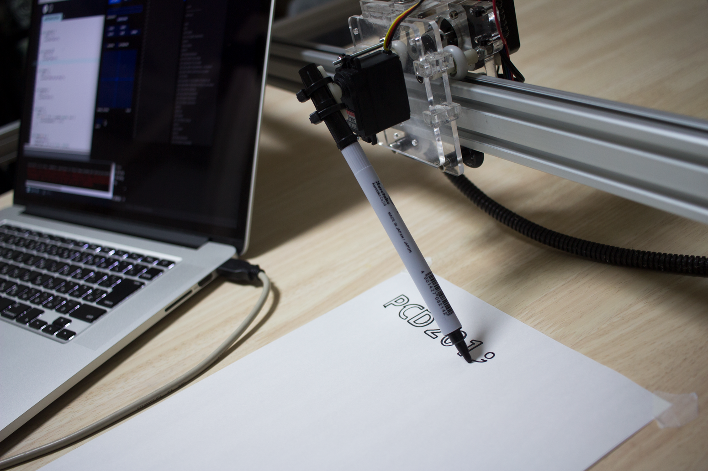
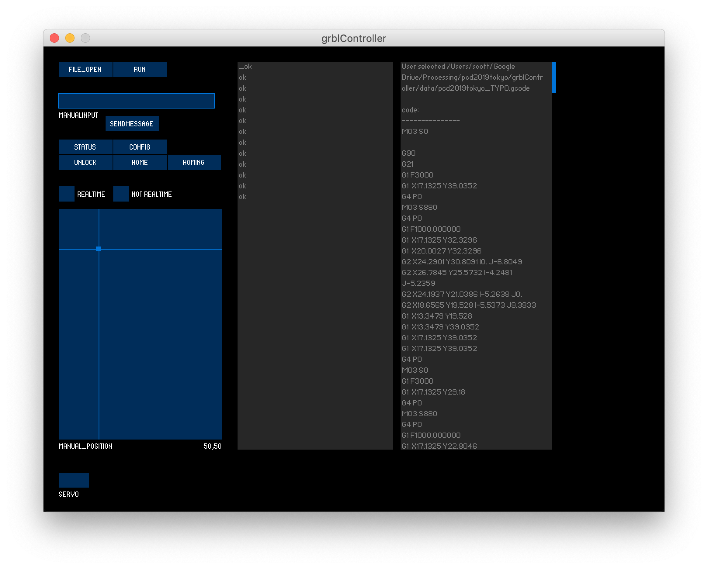

# PCD 2019 Tokyo Workshop(Device Control)
今回講師をさせていただく，Processingユーザーの交流イベント"Processing Community Day 2019 Tokyo"(PCD 2019 Tokyo)のデバイス制御のレポジトリ．
私のワークショップではプロッターやレーザーカッター，3Dプリンタにも使用されているgrblを用いてドローイングロボットを制御します．今後のみなさまの制作の足がかりとなるよう，ドローイングに限らない汎用的な実践にしたいと思っています．
ディスプレイ外でのドローイングや作品制作に興味がある方は是非一緒に遊びましょう！

## Arduino grbl Library(ArduinoGrblLibrary_PCD/)
今回のワークショップの実機は一つのプーリーベルトに2つのステッピングモーターが取り付けられているタイプで，意図した座標に移動するために以下のようなアルゴリズムが必要です．
```
xにa[mm]進む->(a, -a)
yにb[mm]進む->(b, b)
```
そのためconfig.h内で
```
#define COREXY
```
が書かれている行をアンコメントしていることで実現しています．
軸が別れている場合（１つのベルトにつき１つのステッピングモーター）は配布されているままArduinoにアップロードしてください．

## grbl setting(grblSetting_PCD.txt)
```
$0=10 (ステップパルス, μ秒)
$1=25 (ステップアイドル時間, m秒)
$2=0 (ステップポート反転マスク:00000000)
$3=2 (方向ポート反転マスク:0000110)
$4=0 (ステップ有効反転, bool)
$5=0 (リミットpin反転, bool)
$6=0 (探針pin反転, bool)
$10=19 (状態リポートマスク:00000011)
$11=0.010 (接続偏差, mm)
$12=0.002 (円弧寛容性, mm)
$13=0 (リポートインチ, bool)
$20=0 (ソフトリミット, bool)
$21=1 (ハードリミット, bool)
$22=1 (ホーミングサイクル, bool)
$23=3 (ホーミング反転マスク:00000001)
$24=100.000 (ホーミングフィード, mm/min)
$25=2000.000 (ホーミングシーク, mm/min)
$26=250 (ホーミング非跳ね返り, msec)
$27=5.000 (ホーミングpull-off, mm)
$30=1000 (スピンドル最大速度, RPM)
$31=0 (スピンドル最小速度, RPM)
$32=0 (レーザーモード, bool)
$100=80.000 (x, step/mm)
$101=80.000 (y, step/mm)
$102=80.000 (z, step/mm)
$110=3000.000 (x 最大レート, mm/min)
$111=3000.000 (y 最大レート, mm/min)
$112=3000.000 (z 最大レート, mm/min)
$120=900.000 (x 加速, mm/sec^2)
$121=900.000 (y 加速, mm/sec^2)
$122=900.000 (z 加速, mm/sec^2)
$130=310.000 (x 最大移動量, mm)
$131=220.000 (y 最大移動量, mm)
$132=200.000 (z 最大移動量, mm)
```

# grbl controller(grblController/grblController.pde)



## TODO
- gcode stack problem
- touch panel input for signiture drawing
